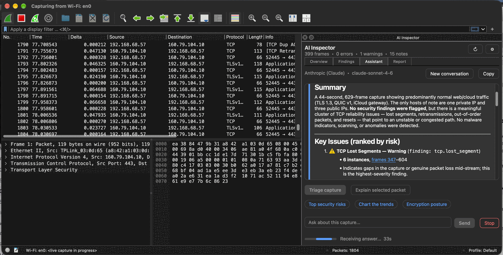
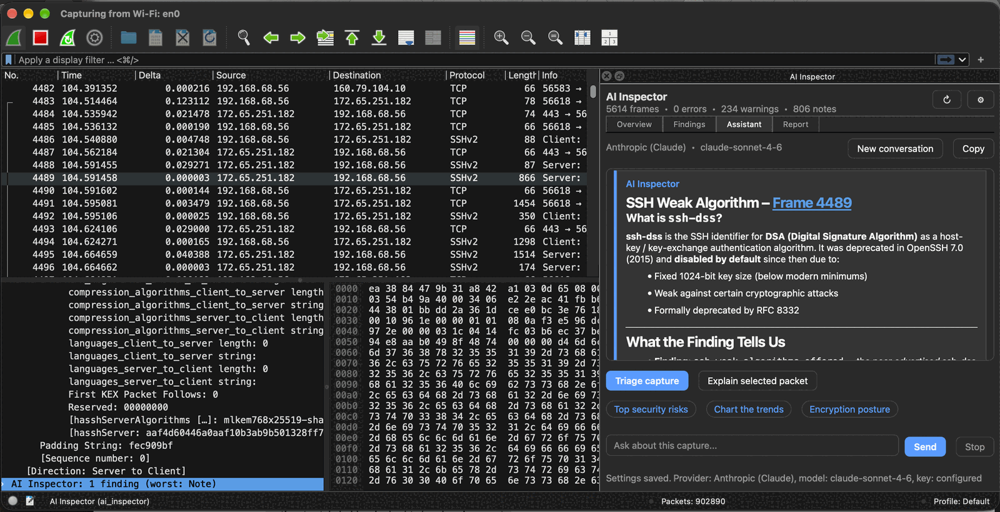

# AI Inspector for Wireshark

AI Inspector is a pair of native Wireshark plugins, plus an MCP server:

- **Analysis engine.** A protocol analysis engine that flags security, performance and protocol problems in common protocols.
- **Dockable panel.** A panel with an overview dashboard, a searchable findings list, and an AI assistant that explains captures and individual packets.
- **MCP server.** The same engine exposed to agents, so a capture can be analyzed without opening Wireshark. Local and read-only; it makes no network requests.

The analysis runs locally and works without any AI provider. The assistant is optional. It supports Anthropic (Claude), OpenAI, or any OpenAI-compatible endpoint such as a local Ollama.



*Triage of a live capture: a plain-language summary, findings ranked by risk, and clickable frame links.*



*Explaining the selected packet: the engine's finding for frame 4489 (SSH weak algorithm) with the context behind it.*

## Download

Binaries are published on the [Releases page](https://github.com/keithknott26/ai-inspector/releases). Each tagged release contains:

| File | What it is |
|---|---|
| `Wireshark-<ver>-x64.exe` | Windows installer: Wireshark with both AI Inspector plugins already included |
| `ai-inspector-<ver>-wireshark-win64-portable.zip` | Portable Windows build. Unzip and run `Wireshark.exe`, nothing to install |
| `ai-inspector-<ver>-win64-plugins.zip` | The two plugin DLLs on their own |
| `ai-inspector-<ver>-src.tar.gz` | Source archive |

**Windows.** Run the installer, or unzip the portable build and start `Wireshark.exe`. Live capture also needs [Npcap](https://npcap.com); opening capture files does not.

**macOS and Linux.** Build from source (see [Quick start](#quick-start)). There are no prebuilt packages yet.

> Plugins are binary modules. They only load in a Wireshark built from the same source revision, compiler and Qt — which is why the Windows downloads ship Wireshark itself. The plugins-only zip fits the matching build in the same release, not a Wireshark you installed separately.

After starting Wireshark, open a capture and choose **Tools > AI Inspector > Open Inspector Panel**. Verify the plugins under **Help > About Wireshark > Plugins**.

## Features

**Analysis engine** (`ai_inspector_engine`, epan plugin)

- Runs as a post-dissector on every frame. Findings appear in:
  - the packet details tree;
  - Expert Information;
  - display-filter fields (`ai_inspector.*`);
  - TShark (`-z ai_inspector,report` or `-z ai_inspector,json`).
- Protocol coverage:

  | Area | Examples |
  |---|---|
  | TLS / DTLS / X.509 | SSLv3 and TLS 1.0/1.1 negotiated, NULL/EXPORT/RC4/DES/3DES suites, expired certificates, SHA-1 signatures, alerts, SNI/JA3/JA4 inventory |
  | QUIC | version negotiation, draft/legacy versions, 0-RTT, CONNECTION_CLOSE errors |
  | Bluetooth LE | legacy pairing, Just Works, short keys, LTK without encryption, cleartext GATT writes |
  | TCP / IP / ICMP | port and stealth scans, retransmissions, zero windows, high RTT, redirects |
  | DNS / HTTP | tunneling, NXDOMAIN bursts, attack patterns, scanner user agents, cleartext credentials |
  | LAN and legacy | ARP spoofing, rogue DHCP, SMBv1, Kerberos RC4, LDAP simple bind, FTP/Telnet/SNMP/MQTT, 802.11 WEP and deauth floods |

- Bounded memory, no network access, about 1–5% overhead on large captures.

**Panel** (`ai_inspector`, Qt UI plugin). Open it from Tools > AI Inspector.

- **Overview.** KPI cards and charts: severity, findings over time, traffic, categories, hosts, protocols and encryption versions. Click a chart to drill in.
- **Findings.** Search, severity and category filters, a detail pane, and one-click go-to-packet or apply-filter.
- **Assistant.**
  - Streaming answers, with Stop and elapsed-time display.
  - Capture triage, explain the selected packet, and follow-up questions.
  - **Pulls what it needs.** Rather than receiving one large block of JSON, the assistant calls back into the engine: `get_findings` (by severity, category, protocol or text), `get_capture_summary`, `get_frame_findings`, `get_selected_packet`, `get_report` and `validate_filter`. The first request stays small, and the answer records which data was consulted. Turn it off in Settings for models without tool calling.
  - Answers can include native charts, clickable display filters (validated with Wireshark's compiler) and frame links.
- **Report.** A plain-text findings report you can save or copy.

**MCP server** (`tools/mcp_server.py`). A stdio Model Context Protocol server with no third-party dependencies, wrapping TShark with the engine plugin: `analyze_capture`, `get_findings`, `get_frame_findings`, `run_filter`, `get_frame` and `get_report`. Point an agent at a `.pcapng` and ask. See [docs/mcp.md](docs/mcp.md).

```sh
tools/mcp_server.py --self-test    # check the wiring
claude mcp add ai-inspector -- python3 "$PWD/tools/mcp_server.py"
```

## Compatibility

| Item | Requirement |
|---|---|
| Wireshark | 4.7 development branch (Qt UI plugin API), pinned in `cmake/AIInspectorVersion.cmake` |
| Qt | 6.x, the same Qt Wireshark is built with |
| Platforms | macOS, Linux, Windows x64 |

## Quick start

Building fetches the pinned Wireshark source and builds it together with the plugins.

```sh
git clone https://github.com/keithknott26/ai-inspector.git
cd ai-inspector
sh tools/build-development.sh --gui-test   # fetches Wireshark, builds, tests
sh tools/run-wireshark.sh                  # starts the development Wireshark
```

On Windows, from a Visual Studio Developer PowerShell:

```powershell
.\tools\build-windows.ps1 -QtDir C:\Qt\6.10.3\msvc2022_64 -Installer
```

Build prerequisites:

- **macOS:** Xcode command line tools, plus `brew install cmake ninja qt glib libgcrypt c-ares pcre2 speexdsp python`.
- **Linux:** see the package list in `.gitlab-ci.yml`.
- **Windows:** Visual Studio 2022 (or Build Tools) with the C++ x64 toolset, Qt 6 (MSVC), Python, Git, winflexbison3, Strawberry Perl and NSIS.

`docs/development-setup.md` covers the details.

## Configuration

**Engine preferences.** Edit > Preferences > Protocols > AI_INSPECTOR.

| Preference | Default | Meaning |
|---|---|---|
| `ai_inspector.enabled` | on | Run the analysis |
| `ai_inspector.min_severity` | Info | Lowest severity shown in packet details |
| `ai_inspector.max_per_id` | 2000 | Per-finding annotation cap (counts continue) |
| `ai_inspector.rtt_ms` | 500 | Latency threshold (TCP/DNS; HTTP uses 4×) |
| `ai_inspector.scan_ports` | 40 | Distinct ports that count as a port scan |

**AI assistant.** Panel > ⚙ Settings.

- **Provider** fills in that provider's default **Endpoint URL** and model.
- **Model** is a dropdown; **Refresh** loads the models your key can use from the provider. You can also type a model name.
- **API key** holds either the name of an environment variable (the default, e.g. `ANTHROPIC_API_KEY` — only the name is saved) or a key you paste, which is written to `~/.config/ai-inspector/api_key` (`%APPDATA%\AI-Inspector\api_key` on Windows) with owner-only permissions.
- **Request timeout**, **Max response tokens** and **Findings sent to AI** default to **Auto**, which picks a value suited to the provider. Enter a number to override.
- **Tool calls** let the assistant request capture data as it needs it instead of receiving one block up front. Leave it on for Anthropic and OpenAI; turn it off for a local model that does not support tool calling.

Environment variables override the saved settings and are never written to disk:

| Variable | Purpose |
|---|---|
| `AI_INSPECTOR_API_KEY` | API key for any provider |
| `ANTHROPIC_API_KEY`, `ANTHROPIC_MODEL`, `ANTHROPIC_BASE_URL` | Anthropic key, model and base URL |
| `OPENAI_API_KEY` | OpenAI key |
| `AI_INSPECTOR_PROVIDER` | `anthropic`, `openai` or `compatible` |
| `AI_INSPECTOR_ENDPOINT`, `AI_INSPECTOR_MODEL` | Endpoint and model overrides |
| `AI_INSPECTOR_KEY_FILE` | Alternate key file |
| `AI_INSPECTOR_SETTINGS_FILE` | Keep all settings in this INI file instead of the system store |

macOS apps started from Finder do not see shell variables. Start Wireshark from a terminal (`tools/run-wireshark.sh`), or save the key in Settings.

**TShark.**

```sh
tshark -r capture.pcapng -q -z ai_inspector,report       # text report
tshark -r capture.pcapng -q -z ai_inspector,json         # machine-readable summary
tshark -r capture.pcapng -Y 'ai_inspector.severity >= 3' # packets with warnings or errors
```

## Privacy and safety

- **What is sent.** Only analysis results (findings, counts, timeline, hosts) and, when you explain a packet, that packet's decoded tree — including anything the assistant requests through a tool call, which comes from the same analysis results. Raw capture bytes are never sent.
- **Addresses.** IP and MAC addresses are replaced with placeholders such as `IP-3(private)` before sending, tool results included. Answers show the real values again, locally only.
- **Credentials.** Credential fields (Authorization, cookies, passwords, SNMP communities, SMP keys) and `password=`/`token=` URL parameters are always removed.
- **Endpoints.** Plain `http://` is refused except for localhost, and redirects are not followed.
- **Tools.** The assistant can only call the six read-only tools listed above; there is no way for it to change a setting, write a file or apply a filter on its own. Tool calls are capped per request and every one is shown in the transcript.
- **Answers.** Model output is untrusted text. Raw HTML is not interpreted and no remote resources load. Filters and packet jumps only happen when you click them, and only after validation.

## Project layout

```
cmake/AIInspectorVersion.cmake  version and pinned Wireshark commit (single source of truth)
native/common/                  C ABI between the plugins and shared helpers
native/engine/                  analysis engine plugin
native/ui/                      Qt UI plugin (panel, dashboard, charts, chat, AI client, settings)
tests/                          unit tests, mock AI server, integration runner
tools/                          fetch, build, run, package, MCP server, test-capture generator
docs/                           architecture, development setup, publishing guide, screenshots
```

## Testing

```sh
cmake -S . -B build-tests -G Ninja && cmake --build build-tests && ctest --test-dir build-tests
python3 tests/run_tests.py --build-dir build-development --gui
```

- **Unit tests.** Engine helpers, the AI client against a local mock server (streaming, errors, timeouts), redaction, settings, charts, chat rendering and panel behaviour.
- **Integration tests.** They generate synthetic captures and check the expected findings in TShark, then drive the MCP server over stdio the way an agent would. They then run a self-test inside a real Wireshark, including AI round trips against the mock server with leak checks.

CI builds and tests on Linux (GitLab) and Windows (GitHub Actions).

## Releasing

1. Bump the version in `cmake/AIInspectorVersion.cmake` and move the `[Unreleased]` notes in `CHANGELOG.md` under it.
2. Commit, then tag and push:

   ```sh
   git tag -a v1.2.0 -m "AI Inspector 1.2.0"
   git push origin main --tags
   ```

3. The tagged Windows build publishes the release with the installer and zips attached. `sh tools/package.sh` builds the source archive and a local binary bundle.

## Documentation

- [docs/architecture.md](docs/architecture.md): how the plugins work and the design rules.
- [docs/development-setup.md](docs/development-setup.md): building, running and debugging.
- [docs/mcp.md](docs/mcp.md): the MCP server, its tools and how to connect an agent.
- [docs/publishing.md](docs/publishing.md): repositories, CI, releases and the upstream Wireshark route.
- [CONTRIBUTING.md](CONTRIBUTING.md): workflow, style, and how to add checks and charts.
- [CHANGELOG.md](CHANGELOG.md).

## License

GPL-2.0-or-later, the same as Wireshark. See [LICENSE](LICENSE).

AI output can be wrong. Verify conclusions against the packets.
